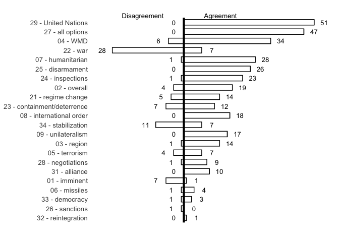
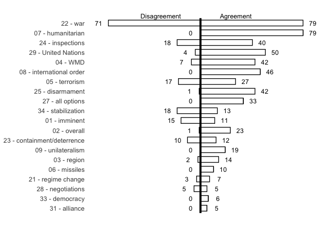

Reproduction files for the chapter ‘Discourse Network Analysis’
================


# Abstract

This [R Markdown](http://rmarkdown.rstudio.com) Notebook is part of the
chapter ‘Discourse Network Anylsis’ in *The Routledge Handbook of
Foreign Policy Methods* (edited by Patrick A. Mello & Falk Ostermann).
It gives readers a more detailed discussion of DNA as a the method, the
coding-scheme, allows them access to the dataset and the script used for
analysis, and shows further graphs that are not used in the chapter, due
to page-limitation.

# Data, Coding-Scheme and Coding

As discussed in the chapter, DNA proceeds in two stages and uses a
combination of qualitative content analysis and social network analysis
for grasping the statements of actors and relating them to each other
(Leifeld 2013, 169). A series of 13 debates in the British House of
Commons from 16 April 2002 trough 18 March 2003 provide the data for
analysing the reasons for the United Kingdom’s participation in the Iraq
War 2003. The dataset is available as an annotated DNA-file
[here](https://github.com/franzeder/dna-example/blob/main/dna_example_UKIraqWar2003.dna).

In the first stage, a category-based coding-scheme is needed, to
annotate this dataset. We can either deductively or inductively (Bauer
2000; Schreier 2014) develop such a scheme or combine both approaches.
Deductively generated codes are developed top-down, inspired by
theoretical assumptions researchers seek to verify. In contrast to that,
inductively generated codes are developed during the process of coding
itself. Combining both approaches is a common and promising procedure
because it allows scholars to do both test their theoretical assumptions
and ensure at the same time, that no categories are overlooked.

For this case study I combined both approaches. Following the secondary
literature (deductive approach) and a close reading of the debates
(inductive approach), I defined 22 claims and grouped these claims into
three different storylines that dominated the overall discourse. These
storyliens are (1) the nature of the Iraqi threat, (2) the policies to
address these threats, and (3) the overall goals of the UK’s policy
towards Iraq and the Middle East. In the first **threat storyline**,
decision-makers feverishly argued whether Iraq and the regime of Saddam
Hussein posed and imminent threat to the UK (Bluth 2004, 871), an
overall threat to the world (Hoggett 2005, 423), or only a threat to the
Middle East.

Furthermore, the actors disagreed whether this threat emanated from the
possible possession and use of weapons of mass destruction (WMD), Iraq’s
supposed link to international terrorism, or its ballistic missile
programme (Bluth 2004, 884; Kennedy-Pipe and Vickers 2007, 211). Another
claim that MPs raised in their contribution was the humanitarian issue
(Hoggett 2005, 418; Kennedy-Pipe and Vickers 2007, 211) and the threat
of Saddam Hussein to his own people (Bluth 2004, 884). Finally, speakers
warned of the threat to the international order if Iraq did not obey to
the United Nations (UN) Security Council resolutions (Bluth 2004, 871),
and feared the consequence of unilateralism, should the United States
decide to go alone (Bluth 2004, 875).

Based on this threat storyline, MPs introduced a second **policy-means
storyline**, presenting their policy preference to tackle these threats.
In this storyline they either proposed regime change, the use of force,
containment and deterrence, arms inspections, disarmament, sanctions,
the threat of force, diplomacy or the involvement of the United Nations
(Security Council), or a combination of these claims, to address the
challenges.

Finally, decision-makers presented in the **policy-goals storyline** the
overall aims the UK sought to achieve. That is to uphold a close
alliance with the United States \[Doig and Phythian (2005), 369;
Kennedy-Pipe2007, 209\], to reintegrate Iraq into the international
community, to democratize the country, and to stabilize the whole
region.

The final coding scheme looks as follows:

#### Threat Storyline

-   01 - imminent (i.e., Iraq/Hussein poses an imminent threat to the
    UK)
-   02 - overall (i.e., Iraq/Hussen poses a threat to the world)
-   03 - region (i.e., Iraq/Hussein poses a threat to the Middle East)
-   04 - WMD (i.e., Iraq/Hussein poses a threat because of weapons of
    mass destruction)
-   05 - terrorism (i.e., Iraq/Hussein poses a threat because of links
    to (transnational) terrorism)
-   06 - missiles (i.e., Iraq/Hussein poses a threat because of
    ballistic missiles)
-   07 - humanitarian (i.e., Iraq/Hussein poses a humanitarian threat to
    its people)
-   08 - international order (i.e., Iraq/Hussein poses a threat to the
    international order)
-   09 - unilateralism (i.e., Iraq/Hussein could further unilateral
    tendencies in the U.S.)

#### Policy-Means Storyline

-   21 - regime change (i.e., the problem can only be solved by
    toppling S. Hussein)
-   22 - war (i.e., the problem can only be solved by going to war with
    Iraq)
-   23 - containment/deterrence (i.e., containment and/or deterrence are
    useful to solve the problem)
-   24 - inspections (i.e., inspections are useful to solve the problem)
-   25 - disarmament (i.e., disarmament is useful to solve the problem)
-   26 - sanctions (i.e., sanctions are useful to solve the problem)
-   27 - all options (i.e., UK must consider all possible options (also
    war))
-   28 - negotiations (i.e., negotiations can solve the problem)
-   29 - United Nations (i.e., the United Nations can help to solve the
    problem)

#### Policy-Goals Storyline

-   31 - alliance (i.e., UK seeks to strengthen the international
    alliance)
-   32 - reintegration (i.e., UK seeks to reintegrate Iraq into the
    international community)
-   33 - democracy (i.e., UK seeks to foster democracy in Iraq)
-   34 - stabilization (i.e., UK seeks to stabilize the Middle East)

I then applied this coding scheme to code statements (i.e., claims) in
the debates. Statements are comprised of four variables (Leifeld 2018,
304–5): actors, organizations, concepts, agreement, and time stamps. An
actor is any person or entity that speaks in a debate and that belongs
to a certain organization. Concepts are political claims (henceforth
claims) that either support or oppose policies, policy instruments, or
certain actions in a policy process (see also Lapesa et al. (2020),
144). Agreement refers to the extent of agreement or opposition of an
actor towards a claim This variable can either be dichotomous (i.e.,
agree – 1 or disagree – 0) or lie within a certain range (e.g., from -5
to +5). Time stamp is a temporal variable that specifies the date and
time of a statement and allows the construction of dynamic networks.

I will demonstrate the application of the coding-scheme with the
following two claims made by Prime Minister Tony Blair in a debate on
18<sup>th</sup> March 2003.

> “Iraq continues to deny that it has any weapons of mass destruction,
> although no serious intelligence service anywhere in the world
> believes it.” (Tony Blair, 18<sup>th</sup> March 2003, c760)

In this passage, Blair argues that Iraq is definitely in possession of
weapons of mass destruction. He refers to the threat story-line and
agrees to the claim “04 - WMD.” Hence, I coded this statement as
follows: “T Blair” (**actor**), “Cabinet” (**organization**), “04 - WMD”
(**concept**), “yes” (**agreement**), “18.05.2003” (**time stamp**).

> “All we are asking for in the second resolution is the clear ultimatum
> that if Saddam continues to fail to co-operate, force should be used.”
> (Tony Blair, 18<sup>th</sup> March 2003, c767)

In this second example from the same debate, Prime Minister Blair calls
for war as means to tackle the threat posed by Saddam Hussein. Hence, I
coded this statement as follows: “T Blair” (**actor**), “Cabinet”
(**organization**), “22 - war” (**concept**), “yes” (**agreement**),
“18.05.2003” (**time stamp**).

In total, I used the 22 claims to code 1,166 statements of 161 persons
(i.e., Members of Parliament), from nine organizations (i.e., parties in
the House of Commons and the Cabinet).

# Network Analysis

After coding the dataset, we then transform the generated data (i.e.,
the sum of coded statements) into a two-mode network (a bipartite
graph), also known as an affiliation network of actors (or
organizations) and claims (for the mathematical details of this
transformation, see Leifeld, Gruber, and Bossner (2019)), that allows us
to display the content, dynamic and drivers of political debates.
Chapter 7 (pages 59-79) of the [*Discourse Network Analyzer
Manual*](https://github.com/leifeld/dna/releases/download/v2.0-beta.24/dna-manual.pdf)
discusses this export with its many options in detail.

In the next paragraphs I will focus on the `R-Code` and show how to
import, analyze and plot the coded-data in this framework (see also
Chapter 8 (pages 80-119) of the [*Discourse Network Analyzer
Manual*](https://github.com/leifeld/dna/releases/download/v2.0-beta.24/dna-manual.pdf)).

## Installing and configuring R and all required packages

Users first have to install the latest version of **R** – “a free
software environment for statistical computing and graphics” – from [The
Comprehensive R Archive Network](https://cran.r-project.org/). Users
should then install [**RSTudio
Desktop**](https://www.rstudio.com/products/rstudio/download/) – “an
integrated development environment (IDE) for R” – that makes programming
in R easier.

After installing R and RStudio, users have to install all required
packages (i.e., extensions that increase the functionality of R).

``` r
install.packages("rJava")

# package needed for installing R packages from Github
install.packages("remotes")

# installing rDNA package
remotes::install_github("leifeld/dna/rDNA@*release",
                        INSTALL_opts = "--no-multiarch")

# installing ggnet2 package for plotting networks
devtools::install_github("briatte/ggnet")

# package for loading R packages and installing them, if they are not already installed
install.packages("pacman")
```

In the next steps, users have to set the path for the working directory
and load the required packages.

``` r
# set the working directory in RStudio to the current file location
setwd(dirname(rstudioapi::getActiveDocumentContext()$path))

# loading the "pacman" package for loading (p_load) packages and installing them,
## if they are not already installed
require(pacman)

# loading required packages for using RStudio to analyze DNA
p_load(rDNA, statnet, GGally, ggnet, network, sna, ggplot2, dplyr)
```

Now, users are able to connect to DNA via R and import the dataset
(“dna_example_UKIraqWar2003.dna”). The various node attributes are then
saved in different objects (`organization`, `person`, `concept`).

``` r
# loading dna
dna_init()

# connection to DNA-file
conn <- dna_connection("dna_example_UKIraqWar2003.dna", verbose = FALSE)

# read and save node attributes 
organization <- dna_getAttributes(conn, variable = "organization")
person <- dna_getAttributes(conn, variable = "person")
concept <- dna_getAttributes(conn, variable = "concept")
```

## Plotting Affiliation Networks

Before plotting the affiliation networks, it makes sense to have a look
at the discursive content of the debate by using the `dna_barplot`
command and displaying the overall agreement and disagreement of actors
towards claims, grouped by year.

``` r
concepts_2002 <- dna_barplot(conn, 
                             of = "concept", fontSize = 10, # plot all claims
                             stop.date = "01.01.2003") # plot claims through 31 December 2002

concepts_2002
```

<!-- -->

As the barplot of 2003 clearly shows, **22 - war** becomes a contested
claim but actors agree, that Iraq/Saddam Hussein poses a **07 -
humanitarian** threat.

``` r
concepts_2003 <- dna_barplot(conn, 
                             of = "concept", fontSize = 10, # plott all claims
                             start.date = "01.01.2003") # plot claims from 1 January 2003 onwards

concepts_2003
```

<!-- -->

In the next step, I display the affiliation network of the most active
speakers (those with more than 9 mentions of a claim) towards four
central claims in the debate (i.e., **01 - imminent**, **22 - war**,
**23 - containment/deterrence**, **24 - inspections**). By it doing so,
I able to show which actors referred to what concepts in the overall
debate.

``` r
selection_person <- person %>% filter(frequency >9) # select actors with more than 9 mentions of a claim
selection_person$value # show this selection
```

    ##  [1] "A MacKay"        "A Simpson"       "B George"        "C Kennedy"      
    ##  [5] "D Anderson"      "D Hogg"          "D Trimble"       "E Leigh"        
    ##  [9] "F Maude"         "G Clifton-Brown" "G Strang"        "ID Smith"       
    ## [13] "J Straw"         "K Clarke"        "M Ancram"        "M Campbell"     
    ## [17] "M Moore"         "P Kilfoyle"      "T Blair"         "T Lloyd"

``` r
exclusion_person <- person %>% filter(frequency < 10) # select actors with less than 10 mentions of a claim

selection_concept <- c(1, 11, 12, 13) # selecting the concepts '01 - imminent', '22 - war', '23 - containment/deterrence', '24 - inspections'
concept$value[selection_concept] # show claims
```

    ## [1] "01 - imminent"               "22 - war"                   
    ## [3] "23 - containment/deterrence" "24 - inspections"

``` r
exclusion_concept <- concept$value[-selection_concept] # create new object with all claim, except the selected claims


# Affiliation network
## person x concept, substract-method and normalization, including duplicates
affil <- dna_network(conn,
                          networkType = "twomode", # affiliation network
                          statementType = "DNA Statement",
                          variable1 = "person",
                          variable2 = "concept",
                          qualifier = "agreement",
                          qualifierAggregation = "subtract",
                          normalization = "prominence",
                          duplicates = "document",
                          verbose = TRUE,
                     excludeValues = list(person = exclusion_person$value, # exclude certain actors and claims
                                          concept = exclusion_concept))
```

    ## (1/5): Processing network options... Done.
    ## (2/5): Filtering statements...
    ##        [Excluded] person: A Beith
    ##        [Excluded] person: A Browning
    ##        [Excluded] person: A Campbell
    ##        [Excluded] person: A Carmichael
    ##        [Excluded] person: A Clwyd
    ##        [Excluded] person: A Duncan
    ##        [Excluded] person: A Howarth
    ##        [Excluded] person: A Ingram
    ##        [Excluded] person: A Mahon
    ##        [Excluded] person: A Robathan
    ##        [Excluded] person: A Robertson
    ##        [Excluded] person: A Salmond
    ##        [Excluded] person: A Selous
    ##        [Excluded] person: A Tyrie
    ##        [Excluded] person: B Bradshaw
    ##        [Excluded] person: B Gardiner
    ##        [Excluded] person: B Jenkin
    ##        [Excluded] person: B Johnson
    ##        [Excluded] person: B Sedgemore
    ##        [Excluded] person: B Spink
    ##        [Excluded] person: B Tynan
    ##        [Excluded] person: C Efford
    ##        [Excluded] person: C Flint
    ##        [Excluded] person: C MacDonald
    ##        [Excluded] person: C Smith
    ##        [Excluded] person: C Soley
    ##        [Excluded] person: D Chaytor
    ##        [Excluded] person: D Curry
    ##        [Excluded] person: D Foster
    ##        [Excluded] person: D Grieve
    ##        [Excluded] person: D Heath
    ##        [Excluded] person: D Henderson
    ##        [Excluded] person: D Mawhinney
    ##        [Excluded] person: D Winnick
    ##        [Excluded] person: E Garnier
    ##        [Excluded] person: E Llwyd
    ##        [Excluded] person: E Ross
    ##        [Excluded] person: F Cook
    ##        [Excluded] person: F Dobson
    ##        [Excluded] person: G Davies
    ##        [Excluded] person: G Foulkes
    ##        [Excluded] person: G Galloway
    ##        [Excluded] person: G Howarth
    ##        [Excluded] person: G Jackson
    ##        [Excluded] person: G Kaufman
    ##        [Excluded] person: G Osborne
    ##        [Excluded] person: G Prentice
    ##        [Excluded] person: G Streeter
    ##        [Excluded] person: G Young
    ##        [Excluded] person: H Bayley
    ##        [Excluded] person: H Cohen
    ##        [Excluded] person: H Jackson
    ##        [Excluded] person: I Paisley
    ##        [Excluded] person: I Taylor
    ##        [Excluded] person: J Baron
    ##        [Excluded] person: J Barrett
    ##        [Excluded] person: J Bazier
    ##        [Excluded] person: J Bercow
    ##        [Excluded] person: J Burnett
    ##        [Excluded] person: J Corbyn
    ##        [Excluded] person: J Denham
    ##        [Excluded] person: J Dowd
    ##        [Excluded] person: J Gummer
    ##        [Excluded] person: J Hume
    ##        [Excluded] person: J Knight
    ##        [Excluded] person: J Lewis
    ##        [Excluded] person: J Maples
    ##        [Excluded] person: J Murphy
    ##        [Excluded] person: J Paice
    ##        [Excluded] person: J Quin
    ##        [Excluded] person: J Randall
    ##        [Excluded] person: J Ruddock
    ##        [Excluded] person: J Sayeed
    ##        [Excluded] person: J Stanley
    ##        [Excluded] person: J Tonge
    ##        [Excluded] person: J Wilkinson
    ##        [Excluded] person: JM McDonnell
    ##        [Excluded] person: JO Jones
    ##        [Excluded] person: K Hughes
    ##        [Excluded] person: K Mountford
    ##        [Excluded] person: L Ellman
    ##        [Excluded] person: L Gilroy
    ##        [Excluded] person: L Hoyle
    ##        [Excluded] person: L Jones
    ##        [Excluded] person: L Smith
    ##        [Excluded] person: L Öpik
    ##        [Excluded] person: M Bruce
    ##        [Excluded] person: M Francois
    ##        [Excluded] person: M Gapes
    ##        [Excluded] person: M Jack
    ##        [Excluded] person: M O'Brien
    ##        [Excluded] person: M O'Neill
    ##        [Excluded] person: M Oaten
    ##        [Excluded] person: M Portillo
    ##        [Excluded] person: M Sarwar
    ##        [Excluded] person: M Savidge
    ##        [Excluded] person: M Singh
    ##        [Excluded] person: M Smyth
    ##        [Excluded] person: N Baker
    ##        [Excluded] person: N Gerrard
    ##        [Excluded] person: N Lamb
    ##        [Excluded] person: N Palmer
    ##        [Excluded] person: N Soames
    ##        [Excluded] person: N Winterton
    ##        [Excluded] person: O Kilfoyle
    ##        [Excluded] person: O King
    ##        [Excluded] person: P Bradley
    ##        [Excluded] person: P Calton
    ##        [Excluded] person: P Cormack
    ##        [Excluded] person: P Flynn
    ##        [Excluded] person: P Keetch
    ##        [Excluded] person: P Mandelson
    ##        [Excluded] person: P Marsden
    ##        [Excluded] person: P Mercer
    ##        [Excluded] person: P Pike
    ##        [Excluded] person: P Tapsell
    ##        [Excluded] person: R Allan
    ##        [Excluded] person: R Burden
    ##        [Excluded] person: R Casale
    ##        [Excluded] person: R Godsiff
    ##        [Excluded] person: R Key
    ##        [Excluded] person: R Marshall-Andrews
    ##        [Excluded] person: R Ottaway
    ##        [Excluded] person: R Page
    ##        [Excluded] person: R Walter
    ##        [Excluded] person: S Bell
    ##        [Excluded] person: S Doughty
    ##        [Excluded] person: S Hughes
    ##        [Excluded] person: S Ladyman
    ##        [Excluded] person: S McCabe
    ##        [Excluded] person: S Thomas
    ##        [Excluded] person: T Banks
    ##        [Excluded] person: T Clarke
    ##        [Excluded] person: T Davis
    ##        [Excluded] person: T Levitt
    ##        [Excluded] person: T Taylor
    ##        [Excluded] person: T Worthington
    ##        [Excluded] person: T Wright
    ##        [Excluded] person: W David
    ##        [Excluded] person: W Griffiths
    ##        [Excluded] person: W Hague
    ##        [Excluded] concept: 02 - overall
    ##        [Excluded] concept: 03 - region
    ##        [Excluded] concept: 04 - WMD
    ##        [Excluded] concept: 05 - terrorism
    ##        [Excluded] concept: 06 - missiles
    ##        [Excluded] concept: 07 - humanitarian
    ##        [Excluded] concept: 08 - international order
    ##        [Excluded] concept: 09 - unilateralism
    ##        [Excluded] concept: 21 - regime change
    ##        [Excluded] concept: 25 - disarmament
    ##        [Excluded] concept: 26 - sanctions
    ##        [Excluded] concept: 27 - all options
    ##        [Excluded] concept: 28 - negotiations
    ##        [Excluded] concept: 29 - United Nations
    ##        [Excluded] concept: 31 - alliance
    ##        [Excluded] concept: 32 - reintegration
    ##        [Excluded] concept: 33 - democracy
    ##        [Excluded] concept: 34 - stabilization
    ##        117 out of 1166 statements retained.
    ## (3/5): Compiling node labels... 
    ##        20 entries for the first and 4 entries for the second variable.
    ## (4/5): Computing network matrix... Done.
    ## (5/5): Retrieving results.

``` r
x <- t(affil) # transpose matrix
y <- selection_person %>% filter(value %in% colnames(x)) # add names of selected actors to matrix

nw <- network(affil, bipartite = TRUE) # convert matrix to a nework-object

colors <- as.character(t(affil)) 
colors <- colors[colors != "0"]
colors[colors < 0] <- "gray85" # add gray color for negative values
colors[colors != "gray85"] <- "black" # add black color for positive values
set.edge.attribute(nw, "color", colors) # add edge attributes colors

plot(nw,
     edge.col = get.edge.attribute(nw, "color"),
     vertex.col = c(y$color,
                    rep("white", ncol(affil))),
     displaylabels = TRUE,
     label.cex = 0.5,
)
```


## Plotting Congruence Networks

After plotting the affiliation network, we can now have a closer look at
the congruence network, that displays the links of actors based on their
shared use of claims. To highlight the dynamic character of the debate,
we group these congruence networks in two periods, that is the years
**2002** and **2003**.

``` r
set.seed(19030023)

selection_concept <- c(1, 11, 12, 13)
concept$value[selection_concept]
```

    ## [1] "01 - imminent"               "22 - war"                   
    ## [3] "23 - containment/deterrence" "24 - inspections"

``` r
exclusion_concept <- concept$value[-selection_concept]

selection_person <- person %>% filter(frequency >5)
selection_person$value
```

    ##  [1] "A Browning"      "A Clwyd"         "A Duncan"        "A Howarth"      
    ##  [5] "A Ingram"        "A MacKay"        "A Mahon"         "A Robathan"     
    ##  [9] "A Salmond"       "A Simpson"       "B Gardiner"      "B George"       
    ## [13] "B Tynan"         "C Kennedy"       "C MacDonald"     "C Smith"        
    ## [17] "D Anderson"      "D Heath"         "D Hogg"          "D Trimble"      
    ## [21] "D Winnick"       "E Garnier"       "E Leigh"         "F Maude"        
    ## [25] "G Clifton-Brown" "G Davies"        "G Foulkes"       "G Jackson"      
    ## [29] "G Strang"        "H Bayley"        "I Paisley"       "ID Smith"       
    ## [33] "J Lewis"         "J Quin"          "J Sayeed"        "J Straw"        
    ## [37] "JM McDonnell"    "K Clarke"        "M Ancram"        "M Bruce"        
    ## [41] "M Campbell"      "M Moore"         "M O'Brien"       "M Sarwar"       
    ## [45] "M Savidge"       "N Baker"         "N Soames"        "O King"         
    ## [49] "P Kilfoyle"      "P Mandelson"     "R Godsiff"       "R Key"          
    ## [53] "R Ottaway"       "R Walter"        "S Doughty"       "S McCabe"       
    ## [57] "T Blair"         "T Lloyd"         "W Hague"

``` r
exclusion_person <- person %>% filter(frequency < 6)

congruence_2002 <- dna_network(conn,
                    networkType = "onemode", # congruence network
                    statementType = "DNA Statement",
                    variable1 = "person", # actors
                    variable2 = "concept", # grouped via shared claims
                    qualifier = "agreement", 
                    qualifierAggregation = "congruence",
                    stop.date = "01.01.2003", # until 1 January 2003 (i.e., all claims from 2002)
                    duplicates = "week", # ignore duplicates within a week
                    excludeValues = list(person = exclusion_person$value, # exclude actors with less than 9 mentions of claims
                                         concept = exclusion_concept)) # exclude concepts, we are not interested in
```

    ## (1/5): Processing network options... Done.
    ## (2/5): Filtering statements...
    ##        [Excluded] person: A Beith
    ##        [Excluded] person: A Campbell
    ##        [Excluded] person: A Carmichael
    ##        [Excluded] person: A Robertson
    ##        [Excluded] person: A Selous
    ##        [Excluded] person: A Tyrie
    ##        [Excluded] person: B Bradshaw
    ##        [Excluded] person: B Jenkin
    ##        [Excluded] person: B Johnson
    ##        [Excluded] person: B Sedgemore
    ##        [Excluded] person: B Spink
    ##        [Excluded] person: C Efford
    ##        [Excluded] person: C Flint
    ##        [Excluded] person: C Soley
    ##        [Excluded] person: D Chaytor
    ##        [Excluded] person: D Curry
    ##        [Excluded] person: D Foster
    ##        [Excluded] person: D Grieve
    ##        [Excluded] person: D Henderson
    ##        [Excluded] person: D Mawhinney
    ##        [Excluded] person: E Llwyd
    ##        [Excluded] person: E Ross
    ##        [Excluded] person: F Cook
    ##        [Excluded] person: F Dobson
    ##        [Excluded] person: G Galloway
    ##        [Excluded] person: G Howarth
    ##        [Excluded] person: G Kaufman
    ##        [Excluded] person: G Osborne
    ##        [Excluded] person: G Prentice
    ##        [Excluded] person: G Streeter
    ##        [Excluded] person: G Young
    ##        [Excluded] person: H Cohen
    ##        [Excluded] person: H Jackson
    ##        [Excluded] person: I Taylor
    ##        [Excluded] person: J Baron
    ##        [Excluded] person: J Barrett
    ##        [Excluded] person: J Bazier
    ##        [Excluded] person: J Bercow
    ##        [Excluded] person: J Burnett
    ##        [Excluded] person: J Corbyn
    ##        [Excluded] person: J Denham
    ##        [Excluded] person: J Dowd
    ##        [Excluded] person: J Gummer
    ##        [Excluded] person: J Hume
    ##        [Excluded] person: J Knight
    ##        [Excluded] person: J Maples
    ##        [Excluded] person: J Murphy
    ##        [Excluded] person: J Paice
    ##        [Excluded] person: J Randall
    ##        [Excluded] person: J Ruddock
    ##        [Excluded] person: J Stanley
    ##        [Excluded] person: J Tonge
    ##        [Excluded] person: J Wilkinson
    ##        [Excluded] person: JO Jones
    ##        [Excluded] person: K Hughes
    ##        [Excluded] person: K Mountford
    ##        [Excluded] person: L Ellman
    ##        [Excluded] person: L Gilroy
    ##        [Excluded] person: L Hoyle
    ##        [Excluded] person: L Jones
    ##        [Excluded] person: L Smith
    ##        [Excluded] person: L Öpik
    ##        [Excluded] person: M Francois
    ##        [Excluded] person: M Gapes
    ##        [Excluded] person: M Jack
    ##        [Excluded] person: M O'Neill
    ##        [Excluded] person: M Oaten
    ##        [Excluded] person: M Portillo
    ##        [Excluded] person: M Singh
    ##        [Excluded] person: M Smyth
    ##        [Excluded] person: N Gerrard
    ##        [Excluded] person: N Lamb
    ##        [Excluded] person: N Palmer
    ##        [Excluded] person: N Winterton
    ##        [Excluded] person: O Kilfoyle
    ##        [Excluded] person: P Bradley
    ##        [Excluded] person: P Calton
    ##        [Excluded] person: P Cormack
    ##        [Excluded] person: P Flynn
    ##        [Excluded] person: P Keetch
    ##        [Excluded] person: P Marsden
    ##        [Excluded] person: P Mercer
    ##        [Excluded] person: P Pike
    ##        [Excluded] person: P Tapsell
    ##        [Excluded] person: R Allan
    ##        [Excluded] person: R Burden
    ##        [Excluded] person: R Casale
    ##        [Excluded] person: R Marshall-Andrews
    ##        [Excluded] person: R Page
    ##        [Excluded] person: S Bell
    ##        [Excluded] person: S Hughes
    ##        [Excluded] person: S Ladyman
    ##        [Excluded] person: S Thomas
    ##        [Excluded] person: T Banks
    ##        [Excluded] person: T Clarke
    ##        [Excluded] person: T Davis
    ##        [Excluded] person: T Levitt
    ##        [Excluded] person: T Taylor
    ##        [Excluded] person: T Worthington
    ##        [Excluded] person: T Wright
    ##        [Excluded] person: W David
    ##        [Excluded] person: W Griffiths
    ##        [Excluded] concept: 02 - overall
    ##        [Excluded] concept: 03 - region
    ##        [Excluded] concept: 04 - WMD
    ##        [Excluded] concept: 05 - terrorism
    ##        [Excluded] concept: 06 - missiles
    ##        [Excluded] concept: 07 - humanitarian
    ##        [Excluded] concept: 08 - international order
    ##        [Excluded] concept: 09 - unilateralism
    ##        [Excluded] concept: 21 - regime change
    ##        [Excluded] concept: 25 - disarmament
    ##        [Excluded] concept: 26 - sanctions
    ##        [Excluded] concept: 27 - all options
    ##        [Excluded] concept: 28 - negotiations
    ##        [Excluded] concept: 29 - United Nations
    ##        [Excluded] concept: 31 - alliance
    ##        [Excluded] concept: 32 - reintegration
    ##        [Excluded] concept: 33 - democracy
    ##        [Excluded] concept: 34 - stabilization
    ##        60 out of 1166 statements retained.
    ## (3/5): Compiling node labels... 
    ##        34 entries for the first and 4 entries for the second variable.
    ## (4/5): Computing network matrix... Done.
    ## (5/5): Retrieving results.

``` r
nw_2002 <- network(congruence_2002)

x <- t(congruence_2002)
y <- selection_person %>% filter(value %in% row.names(x))

plot(nw_2002,
     edge.lwd = congruence_2002,
     displaylabels = TRUE,
     label.cex = 0.5,
     usearrows = FALSE,
     edge.col = "gray85",
     vertex.col = y$color,
     label = y$value
     )
```

<!-- -->

As the both plots clearly show, the majority of actors stuck together
very closely in 2002, by referring to similar claims and united in
opposition to war as a policy option. Furthermore, already in 2002, PM
Blair (accompanied by another cabinet member and Tory MPs) deviated from
this anti-war discourse. In 2003, however, the PM and his cabinet (high
edge betweenness of PM Blair and Foreign Secretary Straw) were
successful in convincing a majority of MPs that war is a necessary evil.
Hence, the discourse in 2003 is characterized by **two opposing
discourse coalitions** – one coalition in favor and one against war as
viable option.

``` r
congruence_2003 <- dna_network(conn,
                               networkType = "onemode",
                               statementType = "DNA Statement",
                               variable1 = "person",
                               variable2 = "concept",
                               qualifier = "agreement",
                               qualifierAggregation = "congruence",
                               start.date = "01.01.2003",
                               duplicates = "week",
                               excludeValues = list(person = exclusion_person$value,
                                                    concept = exclusion_concept))
```

    ## (1/5): Processing network options... Done.
    ## (2/5): Filtering statements...
    ##        [Excluded] person: A Beith
    ##        [Excluded] person: A Campbell
    ##        [Excluded] person: A Carmichael
    ##        [Excluded] person: A Robertson
    ##        [Excluded] person: A Selous
    ##        [Excluded] person: A Tyrie
    ##        [Excluded] person: B Bradshaw
    ##        [Excluded] person: B Jenkin
    ##        [Excluded] person: B Johnson
    ##        [Excluded] person: B Sedgemore
    ##        [Excluded] person: B Spink
    ##        [Excluded] person: C Efford
    ##        [Excluded] person: C Flint
    ##        [Excluded] person: C Soley
    ##        [Excluded] person: D Chaytor
    ##        [Excluded] person: D Curry
    ##        [Excluded] person: D Foster
    ##        [Excluded] person: D Grieve
    ##        [Excluded] person: D Henderson
    ##        [Excluded] person: D Mawhinney
    ##        [Excluded] person: E Llwyd
    ##        [Excluded] person: E Ross
    ##        [Excluded] person: F Cook
    ##        [Excluded] person: F Dobson
    ##        [Excluded] person: G Galloway
    ##        [Excluded] person: G Howarth
    ##        [Excluded] person: G Kaufman
    ##        [Excluded] person: G Osborne
    ##        [Excluded] person: G Prentice
    ##        [Excluded] person: G Streeter
    ##        [Excluded] person: G Young
    ##        [Excluded] person: H Cohen
    ##        [Excluded] person: H Jackson
    ##        [Excluded] person: I Taylor
    ##        [Excluded] person: J Baron
    ##        [Excluded] person: J Barrett
    ##        [Excluded] person: J Bazier
    ##        [Excluded] person: J Bercow
    ##        [Excluded] person: J Burnett
    ##        [Excluded] person: J Corbyn
    ##        [Excluded] person: J Denham
    ##        [Excluded] person: J Dowd
    ##        [Excluded] person: J Gummer
    ##        [Excluded] person: J Hume
    ##        [Excluded] person: J Knight
    ##        [Excluded] person: J Maples
    ##        [Excluded] person: J Murphy
    ##        [Excluded] person: J Paice
    ##        [Excluded] person: J Randall
    ##        [Excluded] person: J Ruddock
    ##        [Excluded] person: J Stanley
    ##        [Excluded] person: J Tonge
    ##        [Excluded] person: J Wilkinson
    ##        [Excluded] person: JO Jones
    ##        [Excluded] person: K Hughes
    ##        [Excluded] person: K Mountford
    ##        [Excluded] person: L Ellman
    ##        [Excluded] person: L Gilroy
    ##        [Excluded] person: L Hoyle
    ##        [Excluded] person: L Jones
    ##        [Excluded] person: L Smith
    ##        [Excluded] person: L Öpik
    ##        [Excluded] person: M Francois
    ##        [Excluded] person: M Gapes
    ##        [Excluded] person: M Jack
    ##        [Excluded] person: M O'Neill
    ##        [Excluded] person: M Oaten
    ##        [Excluded] person: M Portillo
    ##        [Excluded] person: M Singh
    ##        [Excluded] person: M Smyth
    ##        [Excluded] person: N Gerrard
    ##        [Excluded] person: N Lamb
    ##        [Excluded] person: N Palmer
    ##        [Excluded] person: N Winterton
    ##        [Excluded] person: O Kilfoyle
    ##        [Excluded] person: P Bradley
    ##        [Excluded] person: P Calton
    ##        [Excluded] person: P Cormack
    ##        [Excluded] person: P Flynn
    ##        [Excluded] person: P Keetch
    ##        [Excluded] person: P Marsden
    ##        [Excluded] person: P Mercer
    ##        [Excluded] person: P Pike
    ##        [Excluded] person: P Tapsell
    ##        [Excluded] person: R Allan
    ##        [Excluded] person: R Burden
    ##        [Excluded] person: R Casale
    ##        [Excluded] person: R Marshall-Andrews
    ##        [Excluded] person: R Page
    ##        [Excluded] person: S Bell
    ##        [Excluded] person: S Hughes
    ##        [Excluded] person: S Ladyman
    ##        [Excluded] person: S Thomas
    ##        [Excluded] person: T Banks
    ##        [Excluded] person: T Clarke
    ##        [Excluded] person: T Davis
    ##        [Excluded] person: T Levitt
    ##        [Excluded] person: T Taylor
    ##        [Excluded] person: T Worthington
    ##        [Excluded] person: T Wright
    ##        [Excluded] person: W David
    ##        [Excluded] person: W Griffiths
    ##        [Excluded] concept: 02 - overall
    ##        [Excluded] concept: 03 - region
    ##        [Excluded] concept: 04 - WMD
    ##        [Excluded] concept: 05 - terrorism
    ##        [Excluded] concept: 06 - missiles
    ##        [Excluded] concept: 07 - humanitarian
    ##        [Excluded] concept: 08 - international order
    ##        [Excluded] concept: 09 - unilateralism
    ##        [Excluded] concept: 21 - regime change
    ##        [Excluded] concept: 25 - disarmament
    ##        [Excluded] concept: 26 - sanctions
    ##        [Excluded] concept: 27 - all options
    ##        [Excluded] concept: 28 - negotiations
    ##        [Excluded] concept: 29 - United Nations
    ##        [Excluded] concept: 31 - alliance
    ##        [Excluded] concept: 32 - reintegration
    ##        [Excluded] concept: 33 - democracy
    ##        [Excluded] concept: 34 - stabilization
    ##        135 out of 1166 statements retained.
    ## (3/5): Compiling node labels... 
    ##        46 entries for the first and 4 entries for the second variable.
    ## (4/5): Computing network matrix... Done.
    ## (5/5): Retrieving results.

``` r
nw_2003 <- network(congruence_2003)

x <- t(congruence_2003)
y <- selection_person %>% filter(value %in% row.names(x))

plot(nw_2003,
     displaylabels = TRUE,
     label.cex = 0.5,
     usearrows = FALSE,
     edge.col = "gray85",
     vertex.col = y$color,
     label = y$value
     )
```

<!-- -->

## Cluster Analysis

In the final step, we **cluster organizations** (i.e., parties)
according to their overall positions towards the four central claims
mentioned before and display these organizations as distinctive branches
by using the `dna_cluster` command. Organizations of the same branch or
subbranch are ideologically closer than organizations of different
branches.

``` r
selection <- c(1, 11, 12, 13)
concept$value[selection]
```

    ## [1] "01 - imminent"               "22 - war"                   
    ## [3] "23 - containment/deterrence" "24 - inspections"

``` r
exclusion <- concept$value[-selection]

clust_2002 <- dna_cluster(conn,
                          stop.date = "01.01.2003",
                          clust.method = "edge_betweenness",
                          duplicates = "document",
                          excludeValues = list(concept = exclusion))

dna_plotDendro(clust_2002,
               show_legend = FALSE)
```

<!-- -->

The interesting point here is, that the Cabinet’s final discourse in the
debate in 2003 resembled the discourse of the Conservative party (i.e.,
the major opposition). In contrast, Labour’s discourse (i.e., the
discourse of PM’s own party) shared more of the claims the Liberal
Democrats (i.e., the major opposition to war) applied in their
storylines.

``` r
selection <- c(1, 11, 12, 13)
concept$value[selection]
```

    ## [1] "01 - imminent"               "22 - war"                   
    ## [3] "23 - containment/deterrence" "24 - inspections"

``` r
exclusion <- concept$value[-selection]

clust_2003 <- dna_cluster(conn,
                          start.date = "01.01.2003",
                          clust.method = "edge_betweenness",
                          duplicates = "document",
                          excludeValues = list(concept = exclusion))

dna_plotDendro(clust_2003,
               show_legend = FALSE)
```

<!-- -->

# Bibliography

<div id="refs" class="references csl-bib-body hanging-indent">

<div id="ref-Bauer2000" class="csl-entry">

Bauer, Martin W. 2000. “Classical Content Analysis: A Review.” In
*Qualitative Researching with Text, Image and Sound: A Pratical
Handbook*, edited by Martin W. Bauer and George Gaskell, 131–51. Los
Angeles, CA et al.: SAGE.

</div>

<div id="ref-Bluth2004" class="csl-entry">

Bluth, Christoph. 2004. “The British Roard to War: Blair, Bush and the
Decision to Invade Iraq.” *International Affairs* 80 (5): 871–92.
<https://doi.org/10.1111/j.1468-2346.2004.00423.x>.

</div>

<div id="ref-Doig2005" class="csl-entry">

Doig, Alan, and Mark Phythian. 2005. “The National Interest and the
Politics of Threat Exaggeration: The Blair Government’s Case for War
Against Iraq.” *The Political Quarterly* 76 (3): 368–76.
<https://doi.org/10.1111/j.1467-923X.2005.00695.x>.

</div>

<div id="ref-Hoggett2005" class="csl-entry">

Hoggett, Paul. 2005. “Iraq: Blair’s Mission Impossible.” *British
Journal of Politics and International Relations* 7 (3): 418–28.
<https://doi.org/10.1111/j.1467-856X.2005.00195.x>.

</div>

<div id="ref-Kennedy-Pipe2007" class="csl-entry">

Kennedy-Pipe, Caroline, and Rhiannon Vickers. 2007. “‘Blowback’ for
Britain?: Blair, Bush, and the War in Iraq.” *Review of International
Studies* 33 (2): 205–21. <https://doi.org/10.1017/S0260210507007474>.

</div>

<div id="ref-Lapesa2020" class="csl-entry">

Lapesa, Gabriella, Andre Blessing, Nico Blokker, Erenay Dayanik,
Sebastian Haunss, Jonas Kuhn, and Sebastian Padó. 2020. “Analysis of
Political Debates Through Newspaper Reports: Methods and Outcomes.”
*Datenbank Spektrum* 20 (2): 143–53.
<https://doi.org/10.1007/s13222-020-00344-w>.

</div>

<div id="ref-Leifeld2013" class="csl-entry">

Leifeld, Philip. 2013. “Reconceptualizing Major Policy Change in the
Advocacy Coalition Framework: A Discourse Network Analysis of German
Pension Politics.” *The Policy Studies Journal* 41 (1): 169–98.
<https://doi.org/10.1111/psj.12007>.

</div>

<div id="ref-Leifeld2018" class="csl-entry">

———. 2018. “Discourse Network Analysis: Policy Debates as Dynamic
Networks.” In *The Oxford Handbook of Political Networks*, edited by
Jenniger Nicoll Victor, Alexander H. Montgomery, and Mark Lubell,
301–25. Oxford: Oxford University Press.

</div>

<div id="ref-Leifeld2019" class="csl-entry">

Leifeld, Philip, Johannes Gruber, and Felix Rolf Bossner. 2019.
*Discourse Network Analyzer Manual*.
<https://github.com/leifeld/dna/releases/download/v2.0-beta.24/dna-manual.pdf>:
Github.

</div>

<div id="ref-Schreier2014" class="csl-entry">

Schreier, Margit. 2014. “Qualitative Content Analysis.” In *The SAGE
Handbook of Qualitative Data Analysis*, edited by Uwe Flick, 170–83.
London: SAGE.

</div>

</div>
